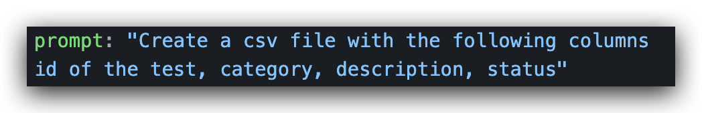
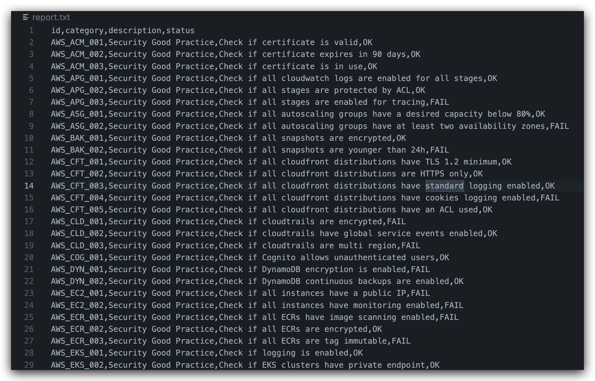

<p align="center">

<p align="center">

# YATAS
[](https://codecov.io/gh/padok-team/YATAS) [](https://goreportcard.com/badge/github.com/padok-team/yatas)

Yet Another Testing &amp; Auditing Solution 

The goal of YATAS is to help you create a secure AWS environment without too much hassle. It won't check for all best practices but only for the ones that are important for you based on my experience. Please feel free to tell me if you find something that is not covered.

## Usage

Run
```
yatas --init
```

This will create a `.yatas.yml` file in your current directory. You can then edit it to your needs.

```yaml
plugins:
    #### Other plugins ####
  - name: "gpt"
    enabled: true
    type: "report"
    source: "github.com/padok-team/yatas-gpt"
    version: "latest"

pluginConfiguration:
  - pluginName: gpt
    config:
      - apiKey: "XXXXX"
        model: ""
        prompt: "Create a csv file with the following columns id of the test, category, description, status"
        forEachTest: false
        onlyFailed: true
```

Then run
```
yatas
```

The output will be in the `report.txt` file.

You can find an api key [here](https://openai.com/blog/openai-api/).


## Example 






